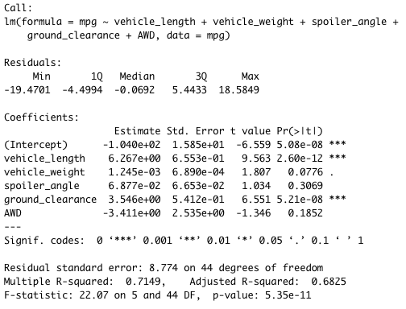
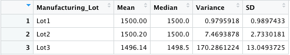
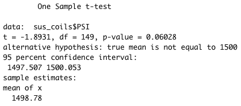
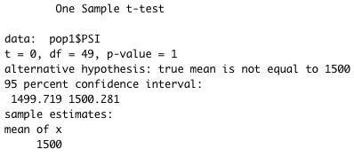
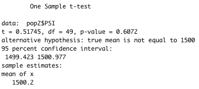
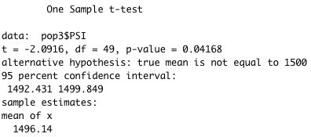

# MechaCar Statistical Analysis

## Overview

The purpose of this analysis is to offer insights on the production of MechaCar to the company’s manufacturing team. I am using two datasets containing info related to the miles per gallon (mpg) and the suspension coils of the MechaCar. I will run this analysis by using R, programming language.

## Linear Regression to Predict MPG

In this section, I used the miles per gallon dataset and preformed a multiple linear regression to see if it could predict the miles per gallon (mpg) dependent variable by using 6 independent vehicle variables. With the data generated I was able to answer the following three questions:

Which variables/coefficients provided a non-random amount of variance to the mpg values in the dataset?
	
There were two variables that provided a non-random amount of variance: The vehicle length and the ground_clearance. Both of these have extremely small p-value meaning that they had a high level of significance. It also should be noted that the intercept as had a high level of significance meaning that there are still other factors contributing to the variance of the miles per gallon of the MechaCar.

2. Is the slope of the linear model considered to be zero? Why or why not?

The slope of the linear model is not considered to be zero, because the linear regression shows that some of the independent variables had a significant effect on the dependent variable. If none of the independent variables had an effect on the dependent variable then the linear regression would result in a near zero slope. 

3. Does this linear model predict mpg of MechaCar prototypes effectively? Why or why not?

The main indicator of whether the linear model predicts the mpg of the MechaCar is the r-squared value. In this case, it is at 0.7149 mean that out of 100 instances, this model would approximately predict the mpg of the MechaCar correctly 71 times. This means that the model would be considered effective.

Here are the summary results from the linear regression.

### Miles Per Gallon Linear Regression

## Summary Statistics on Suspension Coils

In this section, I used the suspension coils dataset. It  was comprised of 150 different vehicles ID, 3 different lot numbers, and corresponding PSI levels for each vehicle. Two summary tables were created to look at the mean, median, variance, and standard deviation of data. The first table looked at of the data as a whole, and the second table looked at each of the three different lots.

### Total Summary Table

### Lot Summary Table

By completing this analysis I want to answer one question:

1. The design specifications for the MechaCar suspension coils dictate that the variance of the suspension coils must not exceed 100 pounds per square inch. Does the current manufacturing data meet this design specification for all manufacturing lots in total and each lot individually? Why or why not?

According to the total summary, the current variance is approximately 76.23 PSI. This does not meet the design specification. After reviewing the lot summaries it shows that the first two lots meet the design specification with a slight variance but the third lot is close to double the design specification.

## T-Tests on Suspension Coils

In this section, I wanted to determine if all manufacturing lots and each lot individually are statistically different from the population mean of 1,500 pounds per square inch. In order to do this, I used R's t.test() function to find four different p-values. The question that I wanted to answer by doing this was:

1. Do any of the four groups have a statistically different mean from the population mean of 1,500 PSI?

By using a significance level of 95%, meaning that 95% of the time this tests results would be true, I tested to see if any of the four groups had a statistical difference from the mean of 1,500 PSI. After running the tests, all four p-values where much greater than .05 meaning that I would fail to reject that there is a statistical difference between the four groups and the population mean.

Here is a breakdown of each of the four tests:

### All Three Lots Combined Test

### Lot 1 Test

### Lot 2 Test

### Lot 3 Test

## Study Design: MechaCar vs Competition

Comparing how the MechaCar performs with the competition and how to go about this.

What metric or metrics are you going to test?

 An important metric to test would be fuel efficiency between MechaCar and comparable vehicles belonging to the competitor.

2. What is the null hypothesis or alternative hypothesis?
Null Hypothesis is that all of the cars in the same class have the same fuel efficiency regardless of the manufacturer. The Alternative Hypothesis is that they are not all the same.

3. What statistical test would you use to test the hypothesis?  And why?
I would use the ANOVA test method for this hypothesis. This method would compute the analysis of variance/deviance in tables for one or more fitted model objects.

4. What data is needed to run the statistical test?

I would need fuel efficiency data from 50 individual cars to create a sample size of data for each car in the class type.
